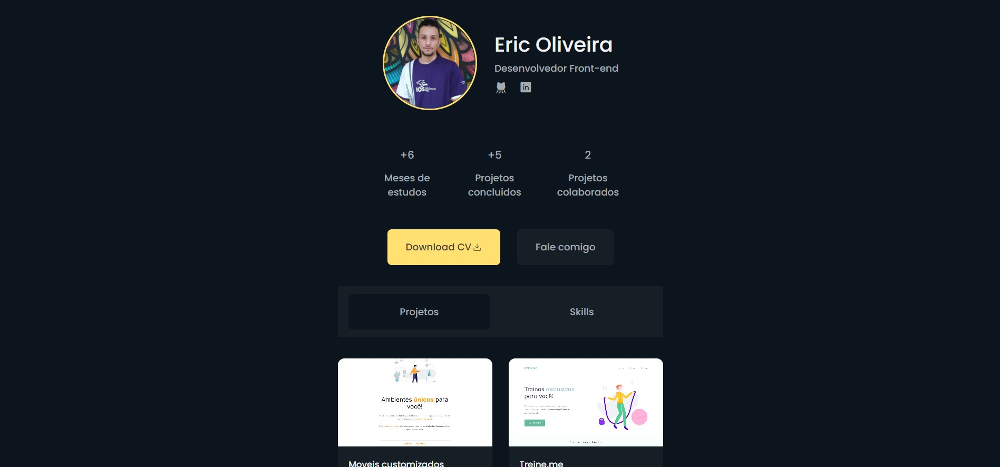

# Portfolio
 

O meu portfolio foi construido pensando no layout do instagram na parte de perfil. Aqui eu gostaria de compartilhar algum de meus projetos e aos poucos adaptando ele.

[Acesse o site por aqui](https://ericodesenvolvedor.github.io/meu-portfolio/)

### Ferramentas utilizadas

- HTML
- CSS
- Figma
- Phosphoricons
- Devicon

### Responsivo 

- Layout responsivo.

### Features

- Pretendo adicionar os projetos de forma interativa, talvez com json server ou graphQL. São conhecimentos que desejo aprender e ir tentando implementar aqui.

- Criar componentes melhores para reutilização no layout.

- Criar scripts.

### Links uteis

Phosphoricons: (https://phosphoricons.com/)

Devicon: (https://devicon.dev/)

Figma Projeto: (https://www.figma.com/community/file/1103832220155964386)

Criado com :heart: por 
  <a href="https://github.com/Ericodesenvolvedor">ericodesenvolvedor</a>

 
